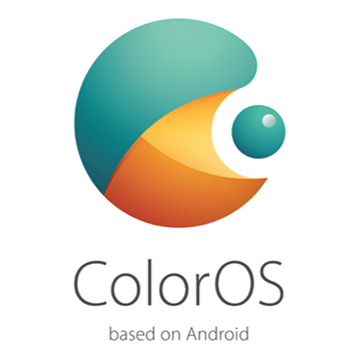
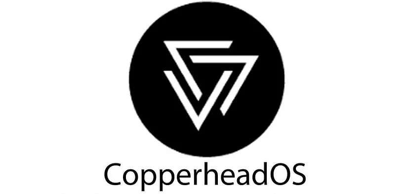
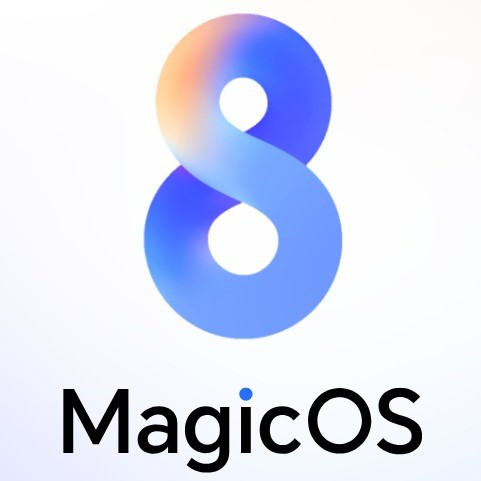

| **Icon**                                                                                                                                                                                                                                                                                                                                                                                                                              | **Name**                                          | **Description**                                                                                                                                                                                                                                                                                                                                                                                 | **Origin**     | **Links**                                                                                                                                                                                                                 |
|---------------------------------------------------------------------------------------------------------------------------------------------------------------------------------------------------------------------------------------------------------------------------------------------------------------------------------------------------------------------------------------------------------------------------------------|---------------------------------------------------|-------------------------------------------------------------------------------------------------------------------------------------------------------------------------------------------------------------------------------------------------------------------------------------------------------------------------------------------------------------------------------------------------|----------------|---------------------------------------------------------------------------------------------------------------------------------------------------------------------------------------------------------------------------|
|                                                                                                                                                                                                                                                                                                                                                           | 2by2 Project                                      | [AOSP] The Custom ROM that focused to JP stuff                                                                                                                                                                                                                                                                                                                                                  | Japan          | [Website](https://project2by2.jp/) [Github](https://github.com/2by2-Project) [Telegram](https://t.me/twobytwodiscussion)                                                                                                  |
|                                                                                                                                                                                                                                                                                                                                                  | Advanced XPerience OS                             | [AOSP] AXP.OS (short for ""Advanced XPerience OS"") is a more private and more secure aftermarket mobile operating system based on DivestOS.                                                                                                                                                                                                                                                    | Germany        | [Website](https://axp.binbash.rocks/) [Github](https://github.com/AXP-OS) [Telegram](https://t.me/sfX_Android)                                                                                                            |
|                                                                                                                                                                                                                                                                                                                                                      | Afterlife Project                                 | [AOSP] An External Version Of Aosp Extended by Fans                                                                                                                                                                                                                                                                                                                                             | Indonesia      | [Github](https://github.com/AfterLifePrjktAOSP) [Sourceforge](https://sourceforge.net/projects/afterlife-projects/files/release/)                                                                                         |
|                                                                                                                                                                                                                                                                                                                                                            | AfterlifeOS                                       | [AOSP] Based On Aosp With some customization                                                                                                                                                                                                                                                                                                                                                    | Indonesia      | [Website](https://afterlifeos.com/) [Github](https://github.com/AfterlifeOS) [Telegram](https://t.me/AfterLife_Update)                                                                                                    |
|                                                                                                                                                                                                                                                                                                                                                                     | AICP (Android Ice Project)                        | [AOSP] AICP is a customized version of Android that offers customizations as well as a clean UI environment with a lot of things to further customize.                                                                                                                                                                                                                                          |                | [Website](https://www.aicp-rom.com/) [Github](https://github.com/AICP)                                                                                                                                                    |
|                                                                                                                                                                                                                                                                                                                                                                 | AIM ROM                                           | [AOSP] AIMROM is based on LineageOS. Its a combination of unmatched stability, performance, and sets of usefull features ensuring sweet taste of latest Android essence stays in your device.. It’s fully responsive, Fast, Smooth and Stable .                                                                                                                                                 | Worldwide      | [Website](https://aimrom.github.io/) [Github](https://github.com/AIMROM)                                                                                                                                                  |
|                                                                                                                                                                                                                                                                                                                                                             | AlphaDroid                                        | [AOSP] AlphaDroid is a custom ROM based on crDroid, with a new look and some extra features and optimizations.                                                                                                                                                                                                                                                                                  |                | [Github](https://github.com/AlphaDroid-Project) [Telegram](https://t.me/alphadroid_chat)                                                                                                                                  |
|                                                                                                                                                                                                                                                                                                                                                              | AlrightOS                                         | [AOSP]                                                                                                                                                                                                                                                                                                                                                                                          | Turkey         | [Website](https://alrightos.xyz/) [Github](https://github.com/AlrightAndroid) [Github - Sandbox](https://github.com/AlrightAndroid-Brokenlab)                                                                             |
|                                                                                                                                                                                                                                                                                                                                                             | AmogOS Rom                                        | [AOSP] Amog-OS Rom is an LMOdroid based ROM which provides stock UI/UX experience with useful features. Being based on LMOdroid it provides a smooth experience. We have added many sussy features from various other open-sus projects and have tried to keep our things sus A ROM by a impostor, for a crewmate. _#BeSussy_                                                                   |                | [Github](https://github.com/AmogOS-Rom) [Telegram](https://t.me/amogosrom)                                                                                                                                                |
|                                                                                                                                                                                                                                                                                                                                                                  | AmyROM                                            | [AOSP] amyROM is a free and open source Android ROM                                                                                                                                                                                                                                                                                                                                             | United Kingdom | [Github](https://github.com/amyROM) [X](https://x.com/amyROM_aosp)                                                                                                                                                        |
|                                                                                                                                                                                                                                                                                                                                                              | Ancient OS                                        | [AOSP] A custom ROM based on AOSP with a focus on performance, security, and stability.                                                                                                                                                                                                                                                                                                         |                | [Website](https://www.ancientrom.xyz/) [Github](https://github.com/Ancient-Lab) [Sourceforge](https://sourceforge.net/projects/ancientrom/files/gsi/)                                                                     |
|                                                                                                                                                                                                                                                                                                                                                                     | AOKP                                              | [AOSP] [Discontinued] Based on LineageOS Developed by Team Kang, Started in year 2011                                                                                                                                                                                                                                                                                                           |                | [Website](http://aokp.co/) [Github](https://github.com/AOKP)                                                                                                                                                              |
|                                                                                                                                                                                                                                                                                                                                                                   | AOSDP                                             | [AOSP] AOSP based fully dark themed ROM                                                                                                                                                                                                                                                                                                                                                         |                | [Github](https://github.com/AOSDP)                                                                                                                                                                                        |
|                                                                                                                                                                                                                                                                                                                                                                   | AOSiP (Android Open Source Illusion Project)      | [AOSP]                                                                                                                                                                                                                                                                                                                                                                                          |                | [Website](https://aosip.dev/) [Github](https://github.com/AOSiP)                                                                                                                                                          |
|                                                                                                                                                                                                                                                                                                                                                           | AOSP Extended                                     | [AOSP] An Android custom ROM based on AOSP with stock experience and customization features.                                                                                                                                                                                                                                                                                                    |                | [Website](https://www.aospextended.com/) [Github](https://github.com/AospExtended)                                                                                                                                        |
|                                                                                                                                                                                                                                                                                                                                                               | Aquari OS                                         | [AOSP] [Discontinued] THIS IS PROJECT NO LONGER ACTIVE! For branches older than pie, see github.com/AquariOS-backup                                                                                                                                                                                                                                                                             |                | [Github](https://github.com/AquariOS)                                                                                                                                                                                     |
|                                                                                                                                                                                                                                                                                                                                                                 | Arrow OS                                          | [AOSP] A simple, clean, and organized AOSP-based project with added features for smooth performance and battery life.                                                                                                                                                                                                                                                                           |                | [Website](https://arrowos.net/) [Github](https://github.com/arrowos)                                                                                                                                                      |
|                                                                                                                                                                                                                                                                                                                                                               | Atomic OS                                         | [AOSP]                                                                                                                                                                                                                                                                                                                                                                                          |                | [Github](https://github.com/Atomic-OS)                                                                                                                                                                                    |
|                                                                                                                                                                                                                                                                                                                                                            | AuroraDroid                                       | [AOSP]                                                                                                                                                                                                                                                                                                                                                                                          | India          | [Github](https://github.com/AuroraDroid)                                                                                                                                                                                  |
|                                                                                                                                                                                                                                                                                                                                                                | BaikalOS                                          | [AOSP]                                                                                                                                                                                                                                                                                                                                                                                          | Russia         | [Github](https://github.com/baikalos)                                                                                                                                                                                     |
|                                                                                                                                                                                                                                                                                                                                                             | BananaDroid                                       | [AOSP]                                                                                                                                                                                                                                                                                                                                                                                          | Indonesia      | [Github](https://github.com/bananadroid)                                                                                                                                                                                  |
|                                                                                                                                                                                                                                                                                                                                                               | BeastROMs                                         | [AOSP]                                                                                                                                                                                                                                                                                                                                                                                          | Worldwide      | [Github](https://github.com/BeastRoms)                                                                                                                                                                                    |
|                                                                                                                                                                                                                                                                                                                                                               | Benzo ROM                                         | [AOSP]                                                                                                                                                                                                                                                                                                                                                                                          |                | [Github](https://github.com/BenzoRom)                                                                                                                                                                                     |
|                                                                                                                                                                                                                                                                                                                                                          | Bianca Project                                    | [AOSP] Simple ROM Based AOSP                                                                                                                                                                                                                                                                                                                                                                    |                | [Github](https://github.com/BiancaProject)                                                                                                                                                                                |
|                                                                                                                                                                                                                                                                                                                                                     | Black Iron Project                                | [AOSP]                                                                                                                                                                                                                                                                                                                                                                                          | Italy          | [Website](https://github.com/Black-Iron-Project) [Github](https://github.com/Black-Iron-Project)                                                                                                                          |
|                                                                                                                                                                                                                                                                                                                                                              | Bliss ROMs                                        | [AOSP]                                                                                                                                                                                                                                                                                                                                                                                          | Worldwide      | [Website](https://blissroms.com/) [Github](https://github.com/BlissRoms)                                                                                                                                                  |
|                                                                                                                                                                                                                                                                                                                                                         | Bootleggers ROM                                   | [AOSP]                                                                                                                                                                                                                                                                                                                                                                                          | Worldwide      | [Website](https://bootleggersrom.github.io/) [Github](https://github.com/BootleggersROM)                                                                                                                                  |
|                                                                                                                                                                                                                                                                                                                                                                  | BsdkOS                                            | [AOSP]                                                                                                                                                                                                                                                                                                                                                                                          | India          | [Github](https://github.com/bsdkOS)                                                                                                                                                                                       |
|                                                                                                                                                                                                                                                                                                                                                            | CAF Extended                                      | [AOSP]                                                                                                                                                                                                                                                                                                                                                                                          |                | [Github](https://github.com/CAF-Extended)                                                                                                                                                                                 |
|                                                                                                                                                                                                                                                                                                                                                                 | CalyxOS                                           | [AOSP] A mobile phone operating system built with ""Privacy by Design"". A project of The Calyx Institute https://calyxinstitute.org, For Google Pixel 3 through 8 Pro, Fairphone 4, SHIFT6mq, Moto G32 through G52, Privacy focused. Developed by Calyx Institute, Started in year 2019                                                                                                        | USA            | [Website](https://calyxos.org/) [Github](https://github.com/CalyxOS)                                                                                                                                                      |
|                                                                                                                                                                                                                                                                                                                                                               | CandyRoms                                         | [AOSP] A ROM based on AOSP with CAF hardware support added in, aiming to enhance battery life and performance.                                                                                                                                                                                                                                                                                  | USA            | [Website](https://candyroms.org/) [Github](https://github.com/CandyRoms)                                                                                                                                                  |
|                                                                                                                                                                                                                                                                                                                                                               | Carbon ROM                                        | [AOSP] An aftermarket firmware based on AOSP created to add versatility and customization to stock Android.                                                                                                                                                                                                                                                                                     |                | [Website](https://carbonrom.org/) [Github](https://github.com/CarbonROM)                                                                                                                                                  |
|                                                                                                                                                                                                                                                                                                                                                             | CatalystOS                                        | [AOSP] The catalyst for your phone                                                                                                                                                                                                                                                                                                                                                              | India          | [Website](https://catalystos.org/) [Github](https://github.com/catalyst-android)                                                                                                                                          |
|                                                                                                                                                                                                                                                                                                                                                               | Cesium OS                                         | [AOSP]                                                                                                                                                                                                                                                                                                                                                                                          | Worldwide      | [Website](http://thecesiumos.me/) [Github](https://github.com/CesiumOS-org)                                                                                                                                               |
|                                                                                                                                                                                                                                                                                                                                                              | Cherish OS                                        | [AOSP] A beautiful ROM based on AOSP and Pixel with good quality of features                                                                                                                                                                                                                                                                                                                    | Vietnam        | [Website](https://cherishos.com/) [Github](https://github.com/CherishOS)                                                                                                                                                  |
|                                                                                                                                                                                                                                                                                                                                                                | CipherOS                                          | [AOSP] Android Custom OS, Sturdy, Stable & Fast.                                                                                                                                                                                                                                                                                                                                                | India          | [Website](https://cipheros.github.io/) [Github](https://github.com/CipherOS)                                                                                                                                              |
|                                                                                                                                                                                                                                                                                                                                                              | Citrus CAF                                        | [AOSP] Tangiest Pie ever! ❤️                                                                                                                                                                                                                                                                                                                                                                    | USA            | [Github](https://github.com/Citrus-CAF)                                                                                                                                                                                   |
|                                                                                                                                                                                                                                                                                                                                                                | ClownUI                                           | [AOSP] Based on AOSP, so Why so Serious !?                                                                                                                                                                                                                                                                                                                                                      | Indonesia      | [Github](https://github.com/ClownUI)                                                                                                                                                                                      |
|                                                                                                                                                                                                                                                                                                                                                                 | Colt OS                                           | [AOSP] Let's get Colt-ify                                                                                                                                                                                                                                                                                                                                                                       | India          | [Github](https://github.com/Colt-Enigma) [SourceForge](https://sourceforge.net/projects/coltos/)                                                                                                                          |
|                                                                                                                                                                                                                                                                                                                                                               | ConquerOS                                         | [AOSP] Simple yet powerful CAF based Custom ROM                                                                                                                                                                                                                                                                                                                                                 | Worldwide      | [Github](https://github.com/ConquerOS)                                                                                                                                                                                    |
|                                                                                                                                                                                                                                                                                                                                                              | Corvus ROM                                        | [AOSP]                                                                                                                                                                                                                                                                                                                                                                                          | India          | [Github](https://github.com/Corvus-AOSP)                                                                                                                                                                                  |
|                                                                                                                                                                                                                                                                                                                                                               | Cosmic OS                                         | [AOSP] #ExploreTheCosmos                                                                                                                                                                                                                                                                                                                                                                        | Worldwide      | [Website](https://cosmic-os.github.io/) [Github](https://github.com/Cosmic-OS)                                                                                                                                            |
|                                                                                                                                                                                                                                                                                                                                                                  | CrDroid                                           | [AOSP] After-market highly customized Android platform for select devices, Based on LineageOS, Developed by crDroid team, Started in year 2014                                                                                                                                                                                                                                                  |                | [Website](https://crdroid.net/) [Github](https://github.com/crdroidandroid)                                                                                                                                               |
|                                                                                                                                                                                                                                                                                                                                                                                                   | CyanogenMod                                       | [AOSP] [Discontinued] open-source operating system for mobile devices, based on the Android mobile platform. Developed between 2009 and 2016, it was free and open-source software based on the official releases of Android by Google, with added original and third-party code, and based on a rolling release development model.                                                             |                | [Website](https://cyanogenmodroms.com/)                                                                                                                                                                                   |
|                                                                                                                                                                                                                                                                                                                                                               | Cygnus OS                                         | [AOSP] A beautiful custom ROM                                                                                                                                                                                                                                                                                                                                                                   |                | [Website](https://cygnusos.com/) [Github](https://github.com/cygnus-rom)                                                                                                                                                  |
|                                                                                                                                                                                                                                                                                                                                                               | Cypher OS                                         | [AOSP] Android Open Source Cypher Project                                                                                                                                                                                                                                                                                                                                                       |                | [Github](https://github.com/CypherOS)                                                                                                                                                                                     |
|                                                                                                                                                                                                                                                                                                                                                                | Derpfest                                          | [AOSP] AOSP based custom ROM, twisted with the latest features from all over the Android development community. Quality and stability is our first priority as we are dedicated to bringing you the best Android has to offer                                                                                                                                                                   | Germany        | [Website](https://derpfest.org/) [Github](https://github.com/DerpFest-AOSP)                                                                                                                                               |
|                                                                                                                                                                                                                                                                                                                                                            | Descendant X                                      | [AOSP] Descendant is a customised Android ROM that focuses on enhancing UX and UI over stock Android along useful features.                                                                                                                                                                                                                                                                     | Italy          | [Website](https://descendant.me/) [Github](https://github.com/Descendant) [Telegram](https://t.me/descendant_device_support) [XDA](https://xdaforums.com/t/shared-rom-12-1-official-veux-descendant-os.4468999/)          |
|                                                                                                                                                                                                                                                                                                                                                          | Dirty Unicorns                                    | [AOSP] An AOSP based project built to enhance the stock Android experience                                                                                                                                                                                                                                                                                                                      | Worldwide      | [Website](https://dirtyunicorns.com/) [Github](https://github.com/DirtyUnicorns)                                                                                                                                          |
|                                                                                                                                                                                                                                                                                                                                                                | DivestOS                                          | [AOSP] Soft fork of LineageOS. Includes Monthly Updates, FOSS Focus, Deblobbing, Security and Privacy focus, and F-Droid Developed by Tavi (SkewedZeppelin), Started in year 2014                                                                                                                                                                                                               |                | [Website](https://divestos.org) [Github](https://github.com/divested-mobile)                                                                                                                                              |
|                                                                                                                                                                                                                                                                                                                                                   | DotOS (Droid On Time)                             | [AOSP] Droid on Time, A beautiful custom ROM based on AOSP, which endeavors the essence of ""Simple. Unique. Stable"".                                                                                                                                                                                                                                                                          |                | [Website](https://www.droidontime.com/) [Github](https://github.com/DotOS)                                                                                                                                                |
|                                                                                                                                                                                                                                                                                                                                                              | DroidX-UI                                         | [AOSP] Ready to unlock the true potential of your device? Meet DroidX-UI!                                                                                                                                                                                                                                                                                                                       | India          | [Website](https://droid-x-ui-github-io.vercel.app/) [Github](https://github.com/DroidX-UI)                                                                                                                                |
|                                                                                                                                                                                                                                                                                                                                                             | eFoundation                                       | [AOSP] We build mobile operating systems, apps and code that put users’ privacy first before profit.                                                                                                                                                                                                                                                                                            |                | [Website](https://e.foundation/) [Github](https://github.com/e-foundation)                                                                                                                                                |
|                                                                                                                                                                                                                                                                                                                                                                | elytraOS                                          | [AOSP] Let your android experience fly.                                                                                                                                                                                                                                                                                                                                                         |                | [Github](https://github.com/elytraOS)                                                                                                                                                                                     |
|                                                                                                                                                                                                                                                                                                                                                            | Eternity OS                                       | [AOSP] Project Based on AOSP with taste of features and customizations.                                                                                                                                                                                                                                                                                                                         |                | [Github](https://github.com/EternityOS-Plus-Tiramisu)                                                                                                                                                                     |
|                                                                                                                                                                                                                                                                                                                                                               | euclidOS                                          | [AOSP]                                                                                                                                                                                                                                                                                                                                                                                          | India          | [Github](https://github.com/euclidTeam)                                                                                                                                                                                   |
|                                                                                                                                                                                                                                                                                                                                                               | EunoiaOS                                          | [AOSP] Android operating system with visual prioritization and stability.                                                                                                                                                                                                                                                                                                                       | Indonesia      | [Github](https://github.com/EunoiaOS)                                                                                                                                                                                     |
|                                                                                                                                                                                                                                                                                                                                                                  | Evervolv                                          | [AOSP]                                                                                                                                                                                                                                                                                                                                                                                          |                | [Github](https://github.com/Evervolv)                                                                                                                                                                                     |
|                                                                                                                                                                                                                                                                                                                                                            | Evolution X                                       | [AOSP] Now based on @LineageOS                                                                                                                                                                                                                                                                                                                                                                  | Philippines    | [Website](https://evolution-x.org/) [Github](https://github.com/Evolution-X) [Sourceforge](https://sourceforge.net/projects/evolution-x) [X](https://twitter.com/EvolutionXROM) [Discord](https://discord.gg/Evolution-X) |
|                                                                                                                                                                                                                                                                                                                                                                | exTHmUI                                           | [AOSP] [Discontinued]                                                                                                                                                                                                                                                                                                                                                                           |                | [Github](https://github.com/exthmui)                                                                                                                                                                                      |
|                                                                                                                                                                                                                                                                                                                                                               | FireHound                                         | [AOSP] A Custom Android ROM focusing on features + stability.                                                                                                                                                                                                                                                                                                                                   |                | [Github](https://github.com/FireHound)                                                                                                                                                                                    |
|                                                                                                                                                                                                                                                                                                                                                            | Flamingo-OS                                       | [AOSP] An open source custom Android OS project based on CLO.                                                                                                                                                                                                                                                                                                                                   |                | [Github](https://github.com/Flamingo-OS)                                                                                                                                                                                  |
|                                                                                                                                                                                                                                                                                                                                                                | FlokoROM                                          | [AOSP] Bring cool new features and a clean experience to your Android device                                                                                                                                                                                                                                                                                                                    |                | [Website](https://floko.maud.io/) [Github](https://github.com/FlokoROM)                                                                                                                                                   |
|                                                                                                                                                                                                                                                                                                                                                                 | FluidOS                                           | [AOSP] An aftermarket AOSP-based custom ROM.                                                                                                                                                                                                                                                                                                                                                    |                | [Website](https://projectfluid.org/) [Github](https://github.com/project-fluid)                                                                                                                                           |
|                                                                                                                                                                                                                                                                                                                                                          | Fork LineageOS                                    | [AOSP] Just another fork of LineageOS maintained by HyperTeam                                                                                                                                                                                                                                                                                                                                   |                | [Github](https://github.com/ForkLineageOS) [Telegram](https://t.me/ForkLineageOS)                                                                                                                                         |
|                                                                                                                                                                                                                                                                                                                                                              | fortuneOS                                         | [AOSP] AOSP based ROM that aims to provide the best pixel experience                                                                                                                                                                                                                                                                                                                            | Indonesia      | [Github](https://github.com/fortuneOS-AOSP)                                                                                                                                                                               |
|                                                                                                                                                                                                                                                                                                                                                               | Freaky OS                                         | [AOSP] #WhySoSerious? #StillAlive                                                                                                                                                                                                                                                                                                                                                               |                | [Website](https://freakyos.me) [Github](https://github.com/FreakyOS)                                                                                                                                                      |
|                                                                                                                                                                                                                                                                                                                                                               | FusionOS                                          | [AOSP]                                                                                                                                                                                                                                                                                                                                                                                          | India          | [Github](https://github.com/Fusion-OS)                                                                                                                                                                                    |
|                                                                                                                                                                                                                                                                                                                                                              | GenesisOS                                         | [AOSP]                                                                                                                                                                                                                                                                                                                                                                                          |                | [Github](https://github.com/GenesisOS)                                                                                                                                                                                    |
|                                                                                                                                                                                                                                                                                                                                                                | GhostOS                                           | [AOSP] Another Android ROM based on AOSP, A Fork of Pixel Experience                                                                                                                                                                                                                                                                                                                            |                | [Github](https://github.com/Ghost-OS-AOSP) [Telegram](https://t.me/GhostOS_AOSP)                                                                                                                                          |
|                                                                                                                                                                                                                                                                                                                                                              | GrapheneOS                                        | [AOSP] Security and privacy focused mobile OS with Android app compatibility. We focus on developing substantial privacy and security improvements.                                                                                                                                                                                                                                             | Canada         | [Website](https://grapheneos.org/) [Github](https://github.com/GrapheneOS)                                                                                                                                                |
|                                                                                                                                                                                                                                                                                                                                                                | Halcyon                                           | [AOSP] Simple yet unique Android distribution                                                                                                                                                                                                                                                                                                                                                   |                | [Website](https://hlcyn.co/) [Github](https://github.com/halcyonproject)                                                                                                                                                  |
|                                                                                                                                                                                                                                                                                                                                                              | Halogen OS                                        | [AOSP] A performant, minimalistic & open-source distribution of the Android Open Source Project. Mirror of https://git.halogenos.org/halogenOS. Not always up-to-date.                                                                                                                                                                                                                          | Germany        | [Website](https://halogenos.org/) [Github](https://github.com/halogenOS)                                                                                                                                                  |
|                                                                                                                                                                                                                                                                                                                                                                | Havoc OS                                          | [AOSP]                                                                                                                                                                                                                                                                                                                                                                                          | India          | [Website](https://havoc-os.com/) [Github](https://github.com/Havoc-OS)                                                                                                                                                    |
|                                                                                                                                                                                                                                                                                                                                                                | Hentai OS                                         | [AOSP]                                                                                                                                                                                                                                                                                                                                                                                          |                | [Website](https://hentaios.com/) [Github](https://github.com/hentaiOS) [Wiki](https://wiki.helluvaos.com/)                                                                                                                |
|                                                                                                                                                                                                                                                                                                                                                                 | HyconOS                                           | [AOSP]                                                                                                                                                                                                                                                                                                                                                                                          | India          | [Github](https://github.com/HyconOS)                                                                                                                                                                                      |
|                                                                                                                                                                                                                                                                                                                                                                                                            | iodéOS                                            | [AOSP]                                                                                                                                                                                                                                                                                                                                                                                          |                | [Website](https://iode.tech/iodeos-en) [Gitlab](https://gitlab.com/iode/)                                                                                                                                                 |
|                                                                                                                                                                                                                                                                                                                                                                  | Ion OS                                            | [AOSP]                                                                                                                                                                                                                                                                                                                                                                                          |                | [Github](https://github.com/i-o-n)                                                                                                                                                                                        |
|                                                                                                                                                                                                                                                                                                                                                          | IronOS Project                                    | [AOSP]                                                                                                                                                                                                                                                                                                                                                                                          |                | [Github](https://github.com/IronOSProject)                                                                                                                                                                                |
|                                                                                                                                                                                                                                                                                                                                                                                                    | Kali NetHunter                                    | [AOSP] Open Source Android penetration testing platform. NetHunter supports Wireless 802.11 frame injection, one-click MANA Evil Access Point setups, HID keyboard, as well as BadUSB MITM attacks – built upon Kali Linux distribution and toolsets. Developed by Kali community member “BinkyBear” & Offensive Security, Started in year 2016                                                 |                |                                                                                                                                                                                                                           |
|                                                                                                                                                                                                                                                                                                                                                                 | Kang OS                                           | [AOSP]                                                                                                                                                                                                                                                                                                                                                                                          |                | [Github](https://github.com/Kang-OS-R)                                                                                                                                                                                    |
|                                                                                                                                                                                                                                                                                                                                                               | Komodo OS                                         | [AOSP]                                                                                                                                                                                                                                                                                                                                                                                          | Indonesia      | [Website](https://komodo-os.my.id/) [Github](https://github.com/Komodo-OS)                                                                                                                                                |
|                                                                                                                                                                                                                                                                                                                                             | Krypton Open Source Project                       | [AOSP] An Android custom ROM project based on AOSP. Discontinued as we have moved over to a CLO base @Flamingo-OS                                                                                                                                                                                                                                                                               |                | [Github](https://github.com/AOSP-Krypton)                                                                                                                                                                                 |
|                                                                                                                                                                                                                                                                                                                                                              | Legion OS                                         | [AOSP]                                                                                                                                                                                                                                                                                                                                                                                          | India          | [Website](http://legionos.tk/) [Github](https://github.com/Project-LegionOS) [SourceForge](https://sourceforge.net/projects/legionrom/)                                                                                   |
|                                                                                                                                                                                                                                                                                                                                                                                                              | LeOS                                              | [AOSP]                                                                                                                                                                                                                                                                                                                                                                                          | Germany        | [Website](https://leos-gsi.de/) [XDA](https://xdaforums.com/t/aosp-12-1-leos-ungoogled-gsi.4356501/)                                                                                                                      |
|                                                                                                                                                                                                                                                                                                                                                               | LessAOSP                                          | [AOSP]                                                                                                                                                                                                                                                                                                                                                                                          |                | [Github](https://github.com/LessAOSP)                                                                                                                                                                                     |
|                                                                                                                                                                                                                                                                                                                                                        | LightningFastRom                                  | [AOSP] Lighting Fast Android OS For Older Devices                                                                                                                                                                                                                                                                                                                                               |                | [Github](https://github.com/lightningfastrom)                                                                                                                                                                             |
|                                                                                                                                                                                                                                                                                                                                                              | Lineage OS                                        | [AOSP] Officially the successor of CyanogenMod. A free and open-source operating system for various devices, based on the Android mobile platform. This is a mirror of https://review.lineageos.org/                                                                                                                                                                                            |                | [Website](https://lineageos.org/) [Github](https://github.com/LineageOS) [Reddit](https://www.reddit.com/r/LineageOS/)                                                                                                    |
|                                                                                                                                                                                                                                                                                                                                                                                                  | Lineage OS R Mod                                  | [AOSP]                                                                                                                                                                                                                                                                                                                                                                                          |                | [Website](https://sourceforge.net/projects/treblerom/files/LiR/)                                                                                                                                                          |
|                                                                                                                                                                                                                                                                                                                                                            | Liquid Remix                                      | [AOSP] Come to the Lounge                                                                                                                                                                                                                                                                                                                                                                       |                | [Github](https://github.com/LiquidRemix)                                                                                                                                                                                  |
|                                                                                                                                                                                                                                                                                                                                                               | LLuvia OS                                         | [AOSP]                                                                                                                                                                                                                                                                                                                                                                                          |                | [Github](https://github.com/LLuviaOS)                                                                                                                                                                                     |
|                                                                                                                                                                                                                                                                                                                                                                | LMODroid                                          | [AOSP] Just a mirror                                                                                                                                                                                                                                                                                                                                                                            |                | [Website](https://git.libremobileos.com/LMODroid/) [Github](https://github.com/LMODroid)                                                                                                                                  |
|                                                                                                                                                                                                                                                                                                                                                                | LunarUI                                           | [AOSP] A custom ROM which is based on LineageOS (WIP)                                                                                                                                                                                                                                                                                                                                           | Kazakhstan     | [Github](https://github.com/Lunar-UI)                                                                                                                                                                                     |
|                                                                                                                                                                                                                                                                                                                                                               | Magnus OS                                         | [AOSP] Greatness Redefined!                                                                                                                                                                                                                                                                                                                                                                     | India          | [Github](https://github.com/Magnus-OS)                                                                                                                                                                                    |
|                                                                                                                                                                                                                                                                                                                                                                | Mallu OS                                          | [AOSP] [Discontinued] A Rom based on LineageOS By Mallu deblobers                                                                                                                                                                                                                                                                                                                               | India          | [Website](https://malluos.github.io/) [Github](https://github.com/MalluOS)                                                                                                                                                |
|                                                                                                                                                                                                                                                                                                                                                                | Miku UI                                           | [AOSP] An AOSP-based Project for Mikufans. (*^_^*). Official Release Channel：https://t.me/mikuuirelease                                                                                                                                                                                                                                                                                         |                | [Github](https://github.com/Miku-UI)                                                                                                                                                                                      |
|                                                                                                                                                                                                                                                                                                                                                                | Mist-OS                                           | [AOSP] Cherry picked beautiful ROM based on AOSP and Pixel with good quality of features 💙                                                                                                                                                                                                                                                                                                     | India          | [Github](https://github.com/Project-Mist-OS)                                                                                                                                                                              |
|                                                                                                                                                                                                                                                                                                                                                                | MoKee ROM                                         | [AOSP]                                                                                                                                                                                                                                                                                                                                                                                          |                | [Website](https://www.mokeedev.com/en/) [Github](https://github.com/MoKee)                                                                                                                                                |
|                                                                                                                                                                                                                                                                                                                                      | Nethunter OS                                      | [AOSP]                                                                                                                                                                                                                                                                                                                                                                                          |                | [Website](https://www.kali.org/docs/nethunter/) [Gitlab](https://gitlab.com/kalilinux/nethunter)                                                                                                                          |
|                                                                                                                                                                                                                                                                                                                                                             | Nitrogen OS                                       | [AOSP] Nitrogen OS (Android 14 for Google Pixel 6a)                                                                                                                                                                                                                                                                                                                                             | Russia         | [Github](https://github.com/nitrogen-project)                                                                                                                                                                             |
|                                                                                                                                                                                                                                                                                                                                                       | Nusantara Project                                 | [AOSP] Probably this wasnt you looking for.                                                                                                                                                                                                                                                                                                                                                     | Indonesia      | [Website](https://nusantararom.org/) [Github](https://github.com/Nusantara-ROM)                                                                                                                                           |
|                                                                                                                                                                                                                                                                                                                                                              | Octavi OS                                         | [AOSP]                                                                                                                                                                                                                                                                                                                                                                                          | India          | [Website](https://octavi-os.com/) [Github](https://github.com/Octavi-Staging)                                                                                                                                             |
|                                                                                                                                                                                                                                                                                                                                                                 | Omni ROM                                          | [AOSP] Open Source Android Firmware, Started in year 2013                                                                                                                                                                                                                                                                                                                                       |                | [Website](https://omnirom.org/) [Github](https://github.com/omnirom)                                                                                                                                                      |
|                                                                                                                                                                                                                                                                                                                                                                | OrionOS                                           | [AOSP] Android Custom ROMs for Your Unique Style.                                                                                                                                                                                                                                                                                                                                               | Indonesia      | [Github](https://github.com/OrionOS-prjkt)                                                                                                                                                                                |
|                                                                                                                                                                                                                                                                                                                                                             | PalladiumOS                                       | [AOSP] An AOSP based project                                                                                                                                                                                                                                                                                                                                                                    | India          | [Website](https://palladiumos.com/) [Github](https://github.com/Palladium-OS)                                                                                                                                             |
|                                                                                                                                                                                                                                                                                                                                                         | Paranoid Android                                  | [AOSP] Based on CAF Developed by Paranoid Android Team, Started in year 2012                                                                                                                                                                                                                                                                                                                    |                | [Website](https://paranoidandroid.co/) [Github](https://github.com/AOSPA)                                                                                                                                                 |
|                                                                                                                                                                                                                                                                                                                                                            | PhoenixAOSP                                       | [AOSP] Phoenix Android 13 ROM                                                                                                                                                                                                                                                                                                                                                                   |                | [Github](https://github.com/PhoenixAOSP)                                                                                                                                                                                  |
|                                                                                                                                                                                                                                                                                                                                                        | Pixel Blaster OS                                  | [AOSP] Custom ROM based on AOSP                                                                                                                                                                                                                                                                                                                                                                 |                | [Website](https://pixelblaster-os.github.io/) [Github](https://github.com/PixelBlaster-OS) [SourceForge](https://sourceforge.net/projects/pixelblaster-os/)                                                               |
|                                                                                                                                                                                                                                                                                                                                                              | Pixel Dust                                        | [AOSP]                                                                                                                                                                                                                                                                                                                                                                                          |                | [Github](https://github.com/PixelDust-Project-X)                                                                                                                                                                          |
|                                                                                                                                                                                                                                                                                                                                                        | Pixel Experience                                  | [AOSP] [Discontinued] PixelExperience is an AOSP based ROM, with Google apps included and all Pixel goodies (launcher, wallpapers, icons, fonts, bootanimation). Started in 2017, Discontinued in April 2024.                                                                                                                                                                                   | Brazil         | [Website](https://download.pixelexperience.org/) [Github](https://github.com/PixelExperience)                                                                                                                             |
|                                                                                                                                                                                                                                                                                                                                                          | Pixel Extended                                    | [AOSP] Fork Of PixelExperience ..Formally Pixel Extended                                                                                                                                                                                                                                                                                                                                        | India          | [Sourceforge](https://sourceforge.net/projects/pixelextended/) [Github](https://github.com/PixelExtended)                                                                                                                 |
|                                                                                                                                                                                                                                                                                                                                                          | Pixel Project                                     | [AOSP] The Pixel Project, an AOSP based custom rom led by a passionate team aiming to provide a clean and smooth experience of stock android with Pixel Goodies.                                                                                                                                                                                                                                | United Kingdom | [Github](https://github.com/The-Pixel-Project)                                                                                                                                                                            |
|                                                                                                                                                                                                                                                                                                                                                                | PixelOS                                           | [AOSP] An AOSP based ROM aiming to provide the best of Pixel                                                                                                                                                                                                                                                                                                                                    | India          | [Website](https://pixelos.net/) [Github](https://github.com/PixelOS-AOSP)                                                                                                                                                 |
|                                                                                                                                                                                                                                                                                                                                                             | PixelPlusUI                                       | [AOSP] PixelPlusUI is minimal UI & close to Stock Android ROM which offers great performance and stability with many useful features                                                                                                                                                                                                                                                            | India          | [Website](https://ppui.site/home) [Github](https://github.com/PixelPlusUI-Elle)                                                                                                                                           |
|                                                                                                                                                                                                                                                                                                                                                              | PixelStar                                         | [AOSP] Another cherry-picked AOSP rom with most of the pixel goodies and some of useful customisation                                                                                                                                                                                                                                                                                           | India          | [Github](https://github.com/Project-PixelStar)                                                                                                                                                                            |
|                                                                                                                                                                                                                                                                                                                                                                | Pixys OS                                          | [AOSP] Another Cherry-picked rom, based on AOSP with minimal customizations                                                                                                                                                                                                                                                                                                                     | India          | [Website](https://downloads.pixysos.com/) [Github](https://github.com/PixysOS)                                                                                                                                            |
|                                                                                                                                                                                                                                                                                                                                                                    | POSP (Potato Open Sauce Project)                  | [AOSP]                                                                                                                                                                                                                                                                                                                                                                                          |                | [Website](https://potatoproject.co/) [Github](https://github.com/PotatoProject)                                                                                                                                           |
|                                                                                                                                                                                                                                                                                                                                                             | Project 404                                       | [AOSP]                                                                                                                                                                                                                                                                                                                                                                                          |                | [Website](https://project404.xyz/) [Github](https://github.com/P-404)                                                                                                                                                     |
|                                                                                                                                                                                                                                                                                                                                                          | Project Arcana                                    | [AOSP] A custom mobile phone operating system based on Android Open Source Project focused on improving user experience, with a little bit of spice.                                                                                                                                                                                                                                            | Philippines    | [Website](https://projectarcana-aosp.github.io/) [Github](https://github.com/projectarcana-aosp)                                                                                                                          |
|                                                                                                                                                                                                                                                                                                                                                          | Project Awaken                                    | [AOSP] Awaken OS brings consistent, fluent and smooth experience with all your must-have customizations, for you, for the community, for everyone.                                                                                                                                                                                                                                              | India          | [Website](https://awakenos.vercel.app/) [Github](https://github.com/Project-Awaken)                                                                                                                                       |
|                                                                                                                                                                                                                                                                                                                                                          | Project Blaze                                     | [AOSP] Enhanced Android experience with customizable features, optimized performance, and security.                                                                                                                                                                                                                                                                                             | India          | [Website](https://www.projectblaze.in/) [Github](https://github.com/ProjectBlaze)                                                                                                                                         |
|                                                                                                                                                                                                                                                                                                                                                          | Project Elixir                                    | [AOSP] Redefining your android experience with our new update which offers minimal UI enhancement and close to Stock android experience with customization                                                                                                                                                                                                                                      | India          | [Website](https://projectelixiros.com/home) [Github](https://github.com/Project-Elixir)                                                                                                                                   |
|                                                                                                                                                                                                                                                                                                                                                        | Project Everest                                   | [AOSP]                                                                                                                                                                                                                                                                                                                                                                                          |                | [Github](https://github.com/ProjectEverest) [Telegram](https://t.me/projecteverest)                                                                                                                                       |
|                                                                                                                                                                                                                                                                                                                                                     | Project Infinity X                                | [AOSP] For Those Who Seek the Infinite! Devices: @Infinity-X-Devices                                                                                                                                                                                                                                                                                                                            | India          | [Github](https://github.com/ProjectInfinity-X) [Sourceforge](https://sourceforge.net/projects/infinity-x/)                                                                                                                |
|                                                                                                                                                                                                                                                                                                                                                    | Project Kaleidoscope                              | [AOSP] One million eyes, one million worlds.                                                                                                                                                                                                                                                                                                                                                    | Worldwide      | [Website](https://kaleidoscope.ink/) [Github](https://github.com/Project-Kaleidoscope)                                                                                                                                    |
|                                                                                                                                                                                                                                                                                                                                                          | Project Kasumi                                    | [AOSP] Another weebified custom ROM aiming to be a home for weebs.                                                                                                                                                                                                                                                                                                                              | Japan          | [Github](https://github.com/ProjectKasumi)                                                                                                                                                                                |
|                                                                                                                                                                                                                                                                                                                                                      | Project Lighthouse                                | [AOSP]                                                                                                                                                                                                                                                                                                                                                                                          |                | [Website](https://lighthouse-os.tech/) [Github](https://github.com/lighthouse-os)                                                                                                                                         |
|                                                                                                                                                                                                                                                                                                                                                        | Project Matrixx                                   | [AOSP] Matrixx is a custom ROM, Based on crDroid Android with extra pinch of Salt.                                                                                                                                                                                                                                                                                                              | India          | [Website](https://projectmatrixx.github.io/) [Github](https://github.com/ProjectMatrixx)                                                                                                                                  |
|                                                                                                                                                                                                                                                                                                                                                        | Project Mushroom                                  | [AOSP] [Discontinued] An AOSP-based Project for Mikufans. (*^_^*). Now we move to https://github.com/Miku-UI                                                                                                                                                                                                                                                                                    |                | [Github](https://github.com/Project-Mushroom)                                                                                                                                                                             |
|                                                                                                                                                                                                                                                                                                                                                                                         | Project Pixelage                                  | [AOSP]                                                                                                                                                                                                                                                                                                                                                                                          | Malaysia       | [Github](https://github.com/ProjectPixelage) [Telegram](https://t.me/projectpixelageupdates) [Sourceforge](https://sourceforge.net/projects/projectpixelage/)                                                             |
|                                                                                                                                                                                                                                                                                                                                                         | Project Radiant                                   | [AOSP]                                                                                                                                                                                                                                                                                                                                                                                          |                | [Github](https://github.com/ProjectRadiant)                                                                                                                                                                               |
|                                                                                                                                                                                                                                                                                                                                                          | Project Sakura                                    | [AOSP] Feels Like Spring..                                                                                                                                                                                                                                                                                                                                                                      | India          | [Website](https://projectsakura.xyz/) [Github](https://github.com/ProjectSakura) [X](https://twitter.com/ProjectSakura_)                                                                                                  |
|                                                                                                                                                                                                                                                                                                                                                          | Project Streak                                    | [AOSP] [Discontinued] nah, check @tequilaOS                                                                                                                                                                                                                                                                                                                                                     | Poland         | [Website](https://projectstreak.pl/) [Github](https://github.com/ProjectStreak)                                                                                                                                           |
|                                                                                                                                                                                                                                                                                                                                                        | Project Titanium                                  | [AOSP] Custom Android ROM Based on AOSP focused on features and speed.                                                                                                                                                                                                                                                                                                                          |                | [Github](https://github.com/Project-Titanium)                                                                                                                                                                             |
|                                                                                                                                                                                                                                                                                                                                                        | Project Zephyrus                                  | [AOSP]                                                                                                                                                                                                                                                                                                                                                                                          | Bangladesh     | [Website](https://zephyrus-website.vercel.app/) [Github](https://github.com/Project-Zephyrus)                                                                                                                             |
|                                                                                                                                                                                                                                                                                                                                                             | Proton AOSP                                       | [AOSP] A minimal custom Android ROM focused on UI/UX and performance, with a touch of privacy.                                                                                                                                                                                                                                                                                                  |                | [Website](https://protonaosp.org/) [Github](https://github.com/ProtonAOSP)                                                                                                                                                |
|                                                                                                                                                                                                                                                                                                                                                                  | RaveOS                                            | [AOSP]                                                                                                                                                                                                                                                                                                                                                                                          |                | [Website](https://raveos.com/) [Discord](https://discord.gg/Dcdadz2)                                                                                                                                                      |
|                                                                                                                                                                                                                                                                                                                                                              | ReloadedOS                                        | [AOSP] ReloadedOS is an Android Custom ROM based on CAF. The main aim of this ROM is to bring stock AOSP experience while offering high performance and excellent battery backup.                                                                                                                                                                                                               |                | [Website](https://reloadedos.org/) [Github](https://github.com/ReloadedOS)                                                                                                                                                |
|                                                                                                                                                                                                                                                                                                                                                                                                         | Replicant                                         | [AOSP] Based on LineageOS, removes or replaces proprietary components and anti-features Developed by Denis Carikli, Paul Kocialkowski, Started in year 2010                                                                                                                                                                                                                                     |                |                                                                                                                                                                                                                           |
|                                                                                                                                                                                                                                                                                                                                                    | Resurrection Remix OS                             | [AOSP] [Discontinued] Developed by Resurrection Remix Team, Started in year 2012                                                                                                                                                                                                                                                                                                                |                | [Website](https://resurrectionremix.com/) [Github](https://github.com/ResurrectionRemix)                                                                                                                                  |
|                                                                                                                                                                                                                                                                                                                                               | ResurrectionRemix-Revived                         | [AOSP] An unofficial fork of @ResurrectionRemix with the aim to deliver the latest security patches beyond its official life.                                                                                                                                                                                                                                                                   |                | [Website](https://resurrectionremix.com/) [Github](https://github.com/ResurrectionRemix-Revived)                                                                                                                          |
|                                                                                                                                                                                                                                                                                                                                                              | Revenge OS                                        | [AOSP] A beautiful custom ROM based on AOSP that's designed to be stable, fast and easy to use. Livin' in the legacy.                                                                                                                                                                                                                                                                           |                | [Website](https://revengeos.com/) [Github](https://github.com/RevengeOS)                                                                                                                                                  |
|                                                                                                                                                                                                                                                                                                                                                               | RiceDroid                                         | [AOSP]                                                                                                                                                                                                                                                                                                                                                                                          |                | [Github](https://github.com/RiceDroid-devices)                                                                                                                                                                            |
|                                                                                                                                                                                                                                                                                                                                                               | RisingOS                                          | [AOSP] Rising Tech Open Source Software (RisingTechOSS)                                                                                                                                                                                                                                                                                                                                         | Philippines    | [Github](https://github.com/RisingTechOSS)                                                                                                                                                                                |
|                                                                                                                                                                                                                                                                                                                                                                 | RohieOS                                           | [AOSP] The Pure AOSP Experience Which Every Users Want. Based On CAF, With Meow Icons (Paradise Of Cats)                                                                                                                                                                                                                                                                                        |                | [Github](https://github.com/RohieOS)                                                                                                                                                                                      |
|                                                                                                                                                                                                                                                                                                                                                            | Scorpion ROM                                      | [AOSP] Custom firmware for Android devices based on Open Source                                                                                                                                                                                                                                                                                                                                 |                | [Website](https://scorpionrom.com/) [Github](https://github.com/ScorpionRom)                                                                                                                                              |
|                                                                                                                                                                                                                                                                                                                                                               | SerasaOS                                          | [AOSP]                                                                                                                                                                                                                                                                                                                                                                                          |                | [Website](https://github.com/SerasaOS) [Github](https://github.com/SerasaOS)                                                                                                                                              |
|                                                                                                                                                                                                                                                                                                                                                           | ShapeShift OS                                     | [AOSP] An AOSP/CAF based project                                                                                                                                                                                                                                                                                                                                                                |                | [Website](https://shapeshiftos.com/) [Github](https://github.com/ShapeShiftOS) [Telegram](https://t.me/ShapeShiftOSChannel)                                                                                               |
|                                                                                                                                                                                                                                                                                                                                                                                                          | Shift OS                                          | [AOSP] Developed by SHIFT GmbH, Started in year 2018                                                                                                                                                                                                                                                                                                                                            |                |                                                                                                                                                                                                                           |
|                                                                                                                                                                                                                                                                                                                                                          | SigmaDroid OS                                     | [AOSP] A custom AOSP ROM with its own development approach.                                                                                                                                                                                                                                                                                                                                     |                | [Website](https://sigmadroid.xyz/) [Github](https://github.com/SigmaDroid-Project) [Telegram](https://t.me/SigmaDroidROMChat)                                                                                             |
|                                                                                                                                                                                                                                                                                                                                                              | SkyLineUI                                         | [AOSP] Based on Android Open Source Project and PixelOS Releases 14.0 QPR2 SkylineUI a Pixel rom that integrates useful features from known custom ROMs.                                                                                                                                                                                                                                        |                | [Github](https://github.com/SkylineUI)                                                                                                                                                                                    |
|                                                                                                                                                                                                                                                                                                                                                                 | SlimRoms                                          | [AOSP] Developed by SlimRoms Team, Started in year 2012                                                                                                                                                                                                                                                                                                                                         |                | [Website](https://slimroms.org/) [Github](https://github.com/slimroms)                                                                                                                                                    |
|                                                                                                                                                                                                                                                                                                                                                            | SomethingOS                                       | [AOSP] SomethingOS is a fork of AOSPA, with extra features and a brand new design                                                                                                                                                                                                                                                                                                               |                | [Website](https://somethingos.com) [Github](https://github.com/SomethingOS)                                                                                                                                               |
|                                                                                                                                                                                                                                                                                                                                                                  | SoniUI                                            | [AOSP]                                                                                                                                                                                                                                                                                                                                                                                          |                | [Github](https://github.com/XOSP-Reborn)                                                                                                                                                                                  |
|                                                                                                                                                                                                                                                                                                                                                                 | SparkOS                                           | [AOSP] Everything began from a spark                                                                                                                                                                                                                                                                                                                                                            |                | [Website](https://www.spark-os.live/) [Github](https://github.com/Spark-Rom)                                                                                                                                              |
|                                                                                                                                                                                                                                                                                                                                                                | Spice OS                                          | [AOSP] Another AOSP ROM trying not to be like AOSP (Under Rebase)                                                                                                                                                                                                                                                                                                                               |                | [Github](https://github.com/SpiceOS)                                                                                                                                                                                      |
|                                                                                                                                                                                                                                                                                                                                                                 | Stag OS                                           | [AOSP] Unlikely like every other rom out there                                                                                                                                                                                                                                                                                                                                                  |                | [Website](https://stag-os.org/) [Github](https://github.com/StagOS)                                                                                                                                                       |
|                                                                                                                                                                                                                                                                                                                                                               | StatiX OS                                         | [AOSP] The official home of StatiX. A homebrew distribution of Android.                                                                                                                                                                                                                                                                                                                         | USA            | [Github](https://github.com/StatiXOS)                                                                                                                                                                                     |
|                                                                                                                                                                                                                                                                                                                                                             | Superior OS                                       | [AOSP] Yet Another AOSP based Custom ROM                                                                                                                                                                                                                                                                                                                                                        | India          | [Website](https://superioros.github.io/) [Github](https://github.com/SuperiorOS)                                                                                                                                          |
|                                                                                                                                                                                                                                                                                                                                                              | Syberia OS                                        | [AOSP] An AOSP based project built to enhance the stock Android experience                                                                                                                                                                                                                                                                                                                      | Russia         | [Website](https://syberiaos.com/) [Github](https://github.com/syberia-project)                                                                                                                                            |
|                                                                                                                                                                                                                                                                                                                                                                  | TenXOS (10X OS)                                   | [AOSP] The Custom ROM!                                                                                                                                                                                                                                                                                                                                                                          | India          | [Github](https://github.com/TenX-OS)                                                                                                                                                                                      |
|                                                                                                                                                                                                                                                                                                                                                             | Tequila OS                                        | [AOSP] ¿qué estás buscando?                                                                                                                                                                                                                                                                                                                                                                     | Poland         | [Website](https://tequilaos.org) [Github](https://github.com/tequilaOS)                                                                                                                                                   |
|                                                                                                                                                                                                                                                                                                                                                      | AOSPK - The Kraken Project                        | [AOSP] based on AOSP with useful customizations for everyday life                                                                                                                                                                                                                                                                                                                               | Brazil         | [Github](https://github.com/AOSPK)                                                                                                                                                                                        |
|                                                                                                                                                                                                                                                                                                                                                        | The Styx Project                                  | [AOSP] A free and open-source aftermarket operating system, based on the Android mobile platform for mobile devices.                                                                                                                                                                                                                                                                            | Worldwide      | [Website](https://styxproject.ml/) [Github](https://github.com/StyxProject)                                                                                                                                               |
|                                                                                                                                                                                                                                                                                                                                                                | Tipsy OS                                          | [AOSP]                                                                                                                                                                                                                                                                                                                                                                                          |                | [Github](https://github.com/TipsyOs)                                                                                                                                                                                      |
|                                                                                                                                                                                                                                                                                                                                                                | Toxyc OS                                          | [AOSP] #StayToxicated!                                                                                                                                                                                                                                                                                                                                                                          |                | [Github](https://github.com/ToxycOS)                                                                                                                                                                                      |
|                                                                                                                                                                                                                                                                                                                                                             | UltimateOS                                        | [AOSP] An Android Operating System Based On AOSP.                                                                                                                                                                                                                                                                                                                                               | India          | [Github](https://github.com/UltimateOS)                                                                                                                                                                                   |
|                                                                                                                                                                                                                                                                                                                                                              | Validus OS                                        | [AOSP]                                                                                                                                                                                                                                                                                                                                                                                          |                | [Github](https://github.com/ValidusOs)                                                                                                                                                                                    |
|                                                                                                                                                                                                                                                                                                                                                                | Viper OS                                          | [AOSP]                                                                                                                                                                                                                                                                                                                                                                                          |                | [Website](https://viperos.gitlab.io/) [Github](https://github.com/ViperOS)                                                                                                                                                |
|                                                                                                                                                                                                                                                                                                                                                                 | VoidUI                                            | [AOSP] AOSP Roms which you had never before Project is based on Pixel Experience Plus version and tons of backend upstreams, fixes and soon we will get new interesting features                                                                                                                                                                                                                |                | [Github](https://github.com/VoidUI)                                                                                                                                                                                       |
|                                                                                                                                                                                                                                                                                                                                                              | Voltage OS                                        | [AOSP]                                                                                                                                                                                                                                                                                                                                                                                          |                | [Github](https://github.com/VoltageOS) [SourceForge](https://sourceforge.net/projects/voltage-os/)                                                                                                                        |
|                                                                                                                                                                                                                                                                                                                                                                  | WaveOS                                            | [AOSP] Android custom ROM project based on AOSP, with a perfect blend of aesthetic, functionality and performance.                                                                                                                                                                                                                                                                              | India          | [Github](https://github.com/Wave-Project)                                                                                                                                                                                 |
|                                                                                                                                                                                                                                                                                                                                                            | Weeb Projekt                                      | [AOSP]                                                                                                                                                                                                                                                                                                                                                                                          | Japan          | [Github](https://github.com/weebproject)                                                                                                                                                                                  |
|                                                                                                                                                                                                                                                                                                                                                                | WitAqua                                           | [AOSP] AOSP based android custom opereting system                                                                                                                                                                                                                                                                                                                                               | Japan          | [Github](https://github.com/WitAqua)                                                                                                                                                                                      |
|                                                                                                                                                                                                                                                                                                                                                              | Xdroid CAF                                        | [AOSP] [Discontinued] we re moving to github.com/xdroid-oss                                                                                                                                                                                                                                                                                                                                     | Indonesia      | [Github](https://github.com/xdroid-CAF)                                                                                                                                                                                   |
|                                                                                                                                                                                                                                                                                                                                                               | xdroidOSS                                         | [AOSP] Android OS with Minimal Design Oriented With all the useful stuff that you love!                                                                                                                                                                                                                                                                                                         | Indonesia      | [Website](http://xd.xyzscape.xyz/) [Github](https://github.com/xdroid-oss)                                                                                                                                                |
|                                                                                                                                                                                                                                                                                                                                                                 | Xenon HD                                          | [AOSP] TeamHorizon's custom ROM for various Android devices                                                                                                                                                                                                                                                                                                                                     |                | [Website](https://www.xenonhd.com/) [Github](https://github.com/TeamHorizon)                                                                                                                                              |
|                                                                                                                                                                                                                                                                                                                                                           | XPerience CAF                                     | [AOSP] CAF based ROM.                                                                                                                                                                                                                                                                                                                                                                           |                | [Github](https://github.com/TheXperienceProject) [SourceForge](https://sourceforge.net/projects/xperience-aosp/)                                                                                                          |
|                                                                                                                                                                                                                                                                                                                                                              | Xtended XS                                        | [AOSP] Custom ROM redefined.                                                                                                                                                                                                                                                                                                                                                                    |                | [Website](https://project-xtended.org/) [Github](https://github.com/Project-Xtended)                                                                                                                                      |
|                                                                                                                                                                                                                                                                                                                                                               | YAAP (Yet Another AOSP Project)                   | [AOSP] A project aiming to stay close to AOSP design goals, offer a clean interface, and avoid becoming a mess.                                                                                                                                                                                                                                                                                 |                | [Website](https://yaosp.dev/) [Github](https://github.com/yaap) [Telegram](https://t.me/yaapcommon)                                                                                                                       |
|                                                                                                                                                                                                                                                                                                                                                                  | ZeusOS                                            | [AOSP]                                                                                                                                                                                                                                                                                                                                                                                          |                | [Github](https://github.com/Zeus-OS)                                                                                                                                                                                      |
|                                                                                                                                                                                                                                                                                                                                                                                               | Android S GSI                                     | [GSI]                                                                                                                                                                                                                                                                                                                                                                                           |                | [Telegram](https://t.me/androidsgsi)                                                                                                                                                                                      |
|                                                                                                                                                                                                                                                                                                                                                                                                              | AOSP 12.1 v416 (treble_experimentations)          | [GSI]                                                                                                                                                                                                                                                                                                                                                                                           |                | [Github](https://github.com/phhusson/treble_experimentations/releases)                                                                                                                                                    |
|                                                                                                                                                                                                                                                                                                                                                                                                          | CAOS A11 (TrebleGSI Files)                        | [GSI]                                                                                                                                                                                                                                                                                                                                                                                           |                | [Sourceforge](https://sourceforge.net/projects/treblerom/files/CAOS11/)                                                                                                                                                   |
|                                                                                                                                                                                                                                                                                                                                                                                                         | Corvus OS (Tipz Team Builds Files)                | [GSI]                                                                                                                                                                                                                                                                                                                                                                                           |                | [Sourceforge](https://sourceforge.net/projects/tipzbuilds/files/GSIs/CorvusROM/)                                                                                                                                          |
|                                                                                                                                                                                                                                                                                                                                                                                                     | CrDroid R Mod (TrebleGSI Files)                   | [GSI]                                                                                                                                                                                                                                                                                                                                                                                           |                | [Sourceforge](https://sourceforge.net/projects/treblerom/files/crDRom11/)                                                                                                                                                 |
|                                                                                                                                                                                                                                                                                                                                                                                               | Firmware Collection (Braialindo)                  | [GSI]                                                                                                                                                                                                                                                                                                                                                                                           |                | [Sourceforge](https://sourceforge.net/projects/braiagsi/files/)                                                                                                                                                           |
|                                                                                                                                                                                                                                                                                                                                                                                               | Firmware Collection (Diust)                       | [GSI]                                                                                                                                                                                                                                                                                                                                                                                           |                | [Sourceforge](https://sourceforge.net/projects/androidgsi/files/)                                                                                                                                                         |
|                                                                                                                                                                                                                                                                                                                                                                                               | Firmware Collection (Eremitein)                   | [GSI]                                                                                                                                                                                                                                                                                                                                                                                           |                | [Sourceforge](https://sourceforge.net/projects/treblerom/files/)                                                                                                                                                          |
|                                                                                                                                                                                                                                                                                                                                                                                               | Firmware Collection (Erfanoabdi)                  | [GSI]                                                                                                                                                                                                                                                                                                                                                                                           |                | [Website](https://mirrors.lolinet.com/firmware/gsi/)                                                                                                                                                                      |
|                                                                                                                                                                                                                                                                                                                                                                                               | Firmware Collection (Lgor-s7)                     | [GSI]                                                                                                                                                                                                                                                                                                                                                                                           |                | [Sourceforge](https://sourceforge.net/projects/amber-gsi/files/)                                                                                                                                                          |
|                                                                                                                                                                                                                                                                                             | Firmware Collection (Nippon) - OneUI              | [GSI]                                                                                                                                                                                                                                                                                                                                                                                           |                | [Sourceforge](https://sourceforge.net/projects/nippongsi/files/) [Telegram](https://t.me/s/nippongsi)                                                                                                                     |
|                                                                                                                                                                                                                                                                                                                                                                                               | Firmware Collection (Trisquel)                    | [GSI]                                                                                                                                                                                                                                                                                                                                                                                           |                | [Sourceforge](https://sourceforge.net/projects/gsi-albus/files/)                                                                                                                                                          |
|                                                                                                                                                                                                                                                                                                                                                                                               | Firmware Collection (Tunahan)                     | [GSI]                                                                                                                                                                                                                                                                                                                                                                                           |                | [Sourceforge](https://sourceforge.net/projects/tunahan-s-builds/files/gsi/)                                                                                                                                               |
|                                                                                                                                                                                                                                                                                                                                            | Firmware Collection (Turbolukex5)                 | [GSI]                                                                                                                                                                                                                                                                                                                                                                                           |                | [Sourceforge](https://sourceforge.net/projects/expressluke-gsis/files/)                                                                                                                                                   |
|                                                                                                                                                                                                                                                                                                                                                                                                    | Google GSI A10                                    | [GSI]                                                                                                                                                                                                                                                                                                                                                                                           |                | [Website](https://ci.android.com/builds/branches/aosp-android10-gsi/grid?)                                                                                                                                                |
|                                                                                                                                                                                                                                                                                                                                                                                                    | Google GSI A11                                    | [GSI]                                                                                                                                                                                                                                                                                                                                                                                           |                | [Website](https://ci.android.com/builds/branches/aosp-android11-gsi/grid?)                                                                                                                                                |
|                                                                                                                                                                                                                                                                                                                                                                                                    | Google GSI A12                                    | [GSI]                                                                                                                                                                                                                                                                                                                                                                                           |                | [Website](https://developer.android.com/about/versions/12/gsi-release-notes#downloads)                                                                                                                                    |
|                                                                                                                                                                                                                                                                                                                                                                                                    | Google GSI A13                                    | [GSI]                                                                                                                                                                                                                                                                                                                                                                                           |                | [Website](https://developer.android.com/about/versions/13/gsi-release-notes#downloads)                                                                                                                                    |
|                                                                                                                                                                                                                                                                                                                                                                                                      | Abhix MIUI                                        | [XIAOMI]                                                                                                                                                                                                                                                                                                                                                                                        |                | [Telegram](https://t.me/ROGEditionUPDATES)                                                                                                                                                                                |
|                                                                                                                                                                                                                                                                                                                                                                                             | CharlieOS                                         | [XIAOMI]                                                                                                                                                                                                                                                                                                                                                                                        |                | [Telegram](https://t.me/s/CharlieOS_Cloud)                                                                                                                                                                                |
|                                                                                                                                                                                                                                                                                                                                                                                                          | DevineUI                                          | [XIAOMI]                                                                                                                                                                                                                                                                                                                                                                                        |                |                                                                                                                                                                                                                           |
|                                                                                                                                                                                                                                                                                                                                                                                                       | EliteRoms                                         | [XIAOMI] Elite Development Project creates custom OS based on MIUI and HyperOS ROMs, is available for several devices, with more being continuously added thanks to the supportive community. Join us and experience a good side of HyperOS and MIUI roms you always desired.                                                                                                                   | Pakistan       | [Website](https://www.elitedevelopment.com.pk/) [Telegram](https://t.me/EliteDevelopmentforMi)                                                                                                                            |
|                                                                                                                                                                                                                                                                                                                                                                                                      | Hyper Mint                                        | [XIAOMI]                                                                                                                                                                                                                                                                                                                                                                                        | Indonesia      | [Telegram](https://t.me/project_mint)                                                                                                                                                                                     |
|                                                                                                                                                                                                                                                                                                                                                                                                         | HyperArt                                          | [XIAOMI] HyperOS Port Mod                                                                                                                                                                                                                                                                                                                                                                       |                | [Telegram](https://t.me/HyperArtRom) [pling](https://www.pling.com/p/2122478)                                                                                                                                             |
|                                                                                                                                                                                                                                                                                                                                                                                                           | HyperIN                                           | [XIAOMI] The Ultra Pure HyperOS ROM                                                                                                                                                                                                                                                                                                                                                             |                | [Website](https://hyperin.vercel.app/) [Github](https://github.com/HyperIN-The-Ultra-Pure-HyperOS-ROM)                                                                                                                    |
|                                                                                                                                                                                                                                                                                                                                                                                                    | HyperOS GoPlus                                    | [XIAOMI]                                                                                                                                                                                                                                                                                                                                                                                        |                |                                                                                                                                                                                                                           |
|                                                                                                                                                                                                                                                                                                                                                                                                    | HyperOS Reborn                                    | [XIAOMI]                                                                                                                                                                                                                                                                                                                                                                                        |                | [Telegram](https://t.me/reborn_dll)                                                                                                                                                                                       |
|                                                                                                                                                                                                                                                                                                                                                                                                  | HyperOS TN                                        | [XIAOMI]                                                                                                                                                                                                                                                                                                                                                                                        |                | [Website](https://miuitn.vercel.app/HyperTN/)                                                                                                                                                                             |
|                                                                                                                                                                                                                                                                                                                                                                                                           | HyperVN                                           | [XIAOMI]                                                                                                                                                                                                                                                                                                                                                                                        |                | [sourceforge](https://sourceforge.net/projects/miuivn/files/fuxi/HyperVN/)                                                                                                                                                |
|                                                                                                                                                                                                                                                                                                                                                                                                 | HyperVoltron                                      | [XIAOMI]                                                                                                                                                                                                                                                                                                                                                                                        |                | [Telegram](https://t.me/s/HyperVoltronUpdates)                                                                                                                                                                            |
|                                                                                                                                                                                                                                                                                                                                                                                                         | MIUI OneOS                                        | [XIAOMI] OneOS, Project for Xiaomi Devices with a lot of features u can see all on website :) When u try, u cant want try another                                                                                                                                                                                                                                                               |                | [Sourceforge](https://sourceforge.net/projects/one-os/)                                                                                                                                                                   |
|                                                                                                                                                                                                                                                                                                                                                                                                         | MIUI Pro                                          | [XIAOMI] Localized MIUI ROMs                                                                                                                                                                                                                                                                                                                                                                    |                | [Sourceforge](https://sourceforge.net/projects/miuipro/)                                                                                                                                                                  |
|                                                                                                                                                                                                                                                                                                                                                                                                            | MIUI TR                                           | [XIAOMI]                                                                                                                                                                                                                                                                                                                                                                                        |                | [Website](https://forum.miuitr.info/bolum/miuitr.5/)                                                                                                                                                                      |
|                                                                                                                                                                                                                                                                                                                                                                                                           | PaperOS                                           | [XIAOMI]                                                                                                                                                                                                                                                                                                                                                                                        |                |                                                                                                                                                                                                                           |
|                                                                                                                                                                                                                                                                                                                                                                                                          | ReavenUI                                          | [XIAOMI]                                                                                                                                                                                                                                                                                                                                                                                        |                |                                                                                                                                                                                                                           |
|                                                                                                                                                                                                                                                                                                                                                                                                         | RemodedUI                                         | [XIAOMI] RemodedUI is An OpenSource Aftermarket modified Android Operating System based on MIUI. With RUi in hand you can experience pure MIUI but with the customisations. RemodedUi is currently based on MIUI 12.5/13/14 versions. RUi is a totally debloated rom with just the core Xiaomi applications that are required by the system.                                                    |                | [XDA](https://xdaforums.com/t/rom-miuimod-13-0-xaga-official-remodedui-lynx-09-07-2023.4608545/)                                                                                                                          |
|                                                                                                                                                                                                                                                                                                                                                         | RevOS                                             | [XIAOMI] MIUI Custom ROM for Xiaomi Devices                                                                                                                                                                                                                                                                                                                                                     |                | [Sourceforge](https://sourceforge.net/projects/revolutionos-miui/)                                                                                                                                                        |
|                                                                                                                                                                                                                                                                                                                                                                | Xiaomi.EU                                         | [XIAOMI]                                                                                                                                                                                                                                                                                                                                                                                        |                | [Website](https://xiaomi.eu/) [Sourceforge](https://sourceforge.net/projects/xiaomi-eu-multilang-miui-roms/files/xiaomi.eu/)                                                                                              |
|                                                                                                                                                                                                                                                                                                                                                                                                               | /e/                                               | [PROPRIETARY] Privacy focused, smartphones with preinstalled OS commercially available. Forked from LineageOS. Formerly called ""Eelo"" and now named MurenaOS. Developed by e Foundation, Started in year 2017                                                                                                                                                                                 |                |                                                                                                                                                                                                                           |
|                                                                                                                                                                                                                                                                                                                                                                                                             | AliOS                                             | [PROPRIETARY] [Discontinued] A forked but incompatible version of Android[33] Developed by Alibaba Cloud, Started in year 2011                                                                                                                                                                                                                                                                  |                |                                                                                                                                                                                                                           |
|                                                                                                                                                                                                                                                                                                                                                                                                          | Baidu Yi                                          | [PROPRIETARY] [Discontinued] Discontinued in March 2015 Developed by Baidu, Inc., Started in year 2011                                                                                                                                                                                                                                                                                          |                |                                                                                                                                                                                                                           |
|                                                                                                                                                                                                                                                                                                                                                                                                             | BharOS                                            | [PROPRIETARY] A fork of the Android Open Source Project, BharOS (formerly IndOS) is a closed source mobile operating system designed by IIT Madras. It is an Indian government-funded project to develop an operating system (OS) for use in government and public systems. Started in year 2023.                                                                                               | India          |                                                                                                                                                                                                                           |
|                                                                                                                                                                                                                                                                                                                                                                                                          | ColorOS                                           | [PROPRIETARY] For OPPO and OnePlus Android Smartphones and Tablets, Started in year 2013                                                                                                                                                                                                                                                                                                        |                |                                                                                                                                                                                                                           |
|                                                                                                                                                                                                                                                                                                                                                                                                | CopperheadOS                                      | [PROPRIETARY] Security- and privacy-focused, no OS analytics by default, smartphones with preinstalled OS commercially available. Developed by Copperhead Security, Started in year 2014                                                                                                                                                                                                        | Canada         | [Github](https://github.com/CopperheadOS)                                                                                                                                                                                 |
|                                                                                                                                                                                                                                                                                                                                                                                                        | emteria.OS                                        | [PROPRIETARY] Platform for building custom Android ROMs (""emteria.OS"") targeted at professional enterprise applications. Supported by a set of remote management and OTA update capabilities (""DeviceHub""). ARM and x86 platforms, custom industrial hardware platforms, strong focus on the Raspberry Pi family (5, 4B, 3B, 400, CM, etc.) Developed by emteria GmbH, Started in year 2017 |                |                                                                                                                                                                                                                           |
|                                                                                                                                                                                                                                                                                                                                                                                                              | EMUI                                              | [PROPRIETARY] [Discontinued] Also known as Magic UI in most of the high-end Honor devices and the current Honor devices after it split with Huawei. Developed by Huawei Technologies Co., Ltd., Started in year 2012                                                                                                                                                                            |                |                                                                                                                                                                                                                           |
|                                                                                                                                                                                                                                                                                                                                                                                                           | Fire OS                                           | [PROPRIETARY] For Amazon Kindle Fire, Fire TV, Fire Phone, Amazon Echo, Centered on content consumption, heavy ties to Amazon's store and content. Developed by Amazon.com, Inc., Started in year 2011                                                                                                                                                                                          |                |                                                                                                                                                                                                                           |
|                                                                                                                                                                                                                                                                                                                                                                                                          | Indus OS                                          | [PROPRIETARY] Developed by Team Indus OS, Started in year 2015                                                                                                                                                                                                                                                                                                                                  |                |                                                                                                                                                                                                                           |
|                                                                                                                                                                                                                                                                                                                                                                                                           | LeWa OS                                           | [PROPRIETARY] [Discontinued]  Developed by Lewa Technology, Started in year 2011                                                                                                                                                                                                                                                                                                                |                |                                                                                                                                                                                                                           |
|                                                                                                                                                                                                                                                                                                                                                                                                                | LG UX                                             | [PROPRIETARY] [Discontinued] For LG Smartphones and Tablets. Succeeding Optimus UI Developed by LG Electronics, Started in year 2012                                                                                                                                                                                                                                                            |                |                                                                                                                                                                                                                           |
|                                                                                                                                                                                                                                                                                                                                                                                                        | MagicOS                                           | [PROPRIETARY] Also known as Magic UI on pre 7.x version, independently developed by Honor for Honor devices after it split with Huawei. Started in year 2016.                                                                                                                                                                                                                                   |                |                                                                                                                                                                                                                           |
|                                                                                                                                                                                                                                                                                                                                                                                                    | MIUI                                              | [PROPRIETARY] [Discontinued] For Xiaomi, Redmi and POCO devices, Succeeded by Xiaomi HyperOS Developed by Xiaomi Corporation, Started in year 2010                                                                                                                                                                                                                                              |                |                                                                                                                                                                                                                           |
|                                                                                                                                                                                                                                                                                                                                                                                                                | My UX                                             | [PROPRIETARY]                                                                                                                                                                                                                                                                                                                                                                                   |                | [Website](https://www.motorola.com/us/my-ux/)                                                                                                                                                                             |
|                                                                                                                                                                                                                                                                                                                                                                                                              | One UI                                            | [PROPRIETARY] Succeeding Samsung Experience UX and TouchWiz Developed by Samsung Electronics Co., Ltd., Started in year 2019                                                                                                                                                                                                                                                                    |                | [Website](https://www.samsung.com/us/apps/one-ui/)                                                                                                                                                                        |
|                                                                                                                                                                                                                                                                                                                                                                                                         | OxygenOS                                          | [PROPRIETARY] For OnePlus Android Smartphones, Merged with HydrogenOS in 2018. Using ColorOS codebase from 12.0 release. Developed by OnePlus, Started in year 2015                                                                                                                                                                                                                             |                | [Website](https://www.oneplus.in/oxygenos15)                                                                                                                                                                              |
|                                                                                                                                                                                                                                                                                                                                                                                                       | realme UI                                         | [PROPRIETARY] For Realme devices, Based on ColorOS, Started in year 2020.                                                                                                                                                                                                                                                                                                                       |                | [Website](https://www.realme.com/in/realme-ui)                                                                                                                                                                            |
|                                                                                                                                                                                                                                                                                                                                                                                                      | Smartisan OS                                      | [PROPRIETARY] [Discontinued]  Developed by Smartisan, Started in year 2012                                                                                                                                                                                                                                                                                                                      |                |                                                                                                                                                                                                                           |
|                                                                                                                                                                                                                                                                                                                                                                                                   | Xiaomi HyperOS                                    | [PROPRIETARY] For Xiaomi, Redmi and POCO devices, Succeeding MIUI Developed by Xiaomi Corporation, Started in year 2023                                                                                                                                                                                                                                                                         |                |                                                                                                                                                                                                                           |
|                                                                                                                                                                                                                                                                                                                                      | OrangeFox Recovery                                | [RECOVERY] OrangeFox Recovery is one of the most popular custom recoveries, with amazing additional features, fixes and a host of supported devices                                                                                                                                                                                                                                             |                | [Website](https://orangefox.download) [Gitlab](https://gitlab.com/OrangeFox)                                                                                                                                              |
|                                                                                                                                                                                                                                                                                                                                            | Pitch Black Recovery Project                      | [RECOVERY] Android recovery is a dedicated recovery console which is independent of Android OS, provides most of the utilities to recover your device.                                                                                                                                                                                                                                          |                | [Website](https://pitchblackrecovery.com/) [Github](https://github.com/PitchBlackRecoveryProject)                                                                                                                         |
|                                                                                                                                                                                                                                                                                                                                                       | Pterodon Recovery                                 | [RECOVERY] A brand new android custom recovery, built by the community for the community.                                                                                                                                                                                                                                                                                                       |                | [Github](https://github.com/PterodonRecovery) [Telegram](https://t.me/joinchat/FZlpFBdO4Hypy6oVASltqA)                                                                                                                    |
|                                                                                                                                                                                                                                                                                                                                                | RedWolf Recovery Project                          | [RECOVERY] Origin - EU                                                                                                                                                                                                                                                                                                                                                                          |                | [Website](https://redwolfrecovery.github.io/) [Github](https://github.com/RedWolfRecovery)                                                                                                                                |
|                                                                                                                                                                                                                                                                                                                                        | SHRP – Sky Hawk Recovery Project                  | [RECOVERY] SHRP is inspired by mordern design to bring the newest design to the native TWRP. SHRP provides much more along side of it's rich UI experience.                                                                                                                                                                                                                                     |                | [Website](https://skyhawkrecovery.github.io/) [Github](https://github.com/SHRP) [Telegram](https://t.me/sky_hawk)                                                                                                         |
|                                                                                                                                                                                                                                                                                          | TWRP – Team Win Recovery Project                  | [RECOVERY] A custom recovery is used for installing custom software on your device.                                                                                                                                                                                                                                                                                                             |                | [Website](https://twrp.me/) [Github](https://github.com/TeamWin)                                                                                                                                                          |
|  | APatch : The Patching of Android Kernel & System  | [ROOT] The patching of Android kernel and Android system                                                                                                                                                                                                                                                                                                                                        |                | [Github](https://github.com/bmax121/APatch)                                                                                                                                                                               |
|                                                                                                                                                                                                                   | KernelSU : Kernel Based Root Solution for Android | [ROOT] A Kernel based root solution for Android                                                                                                                                                                                                                                                                                                                                                 |                | [Website](https://kernelsu.org) [Github](https://github.com/tiann/KernelSU)                                                                                                                                               |
|                                                                                                                                                                                                                                                                                                                                                                           | Magisk : The Magic Mask for Android               | [ROOT] The Magic Mask for Android - Provide root access for applications                                                                                                                                                                                                                                                                                                                        |                | [Github](https://github.com/topjohnwu/Magisk)                                                                                                                                                                             |